The GeoGig QGIS plugin allow you to manage GeoGig repositories from QGIS, adding layers to your QGIS projects from a GeoGig repository and updating it with the changes that you make to those layers using QGIS editing capabilities.

This document describes a typical workflow with the GeoGig plugin, going through its main features.

Basic workflow 
#########################################

The following sections describe a typical workflow in which a new repository is created and data is later added to it and edited.


Creating a new repository
**************************

To create a new repository, open the GeoGig Navigator selecting the "GeoGig Navigator" item in the "GeoGig" menu.

In the Navigator window, click on the *Create new repository* button.

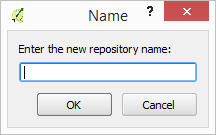

Enter the repository title. Click on OK. The new repository will be added to the list of your personal repositories.

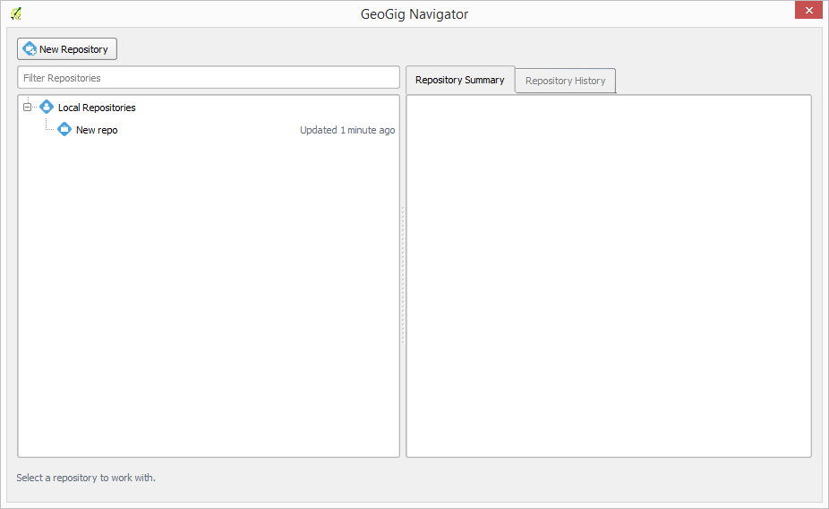

Clicking on it you will see the information about it in the right-hand side of the Navigator window.

In the *Repository Viewer* tab you can see the content of the repository. 

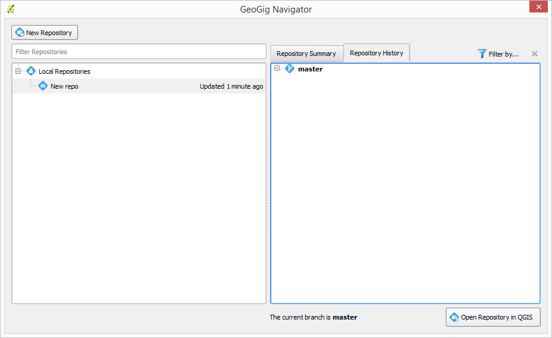

For a repository that has just been created, a single branch named *master* will be shown, containing no versions. 

Adding a layer to a repository
******************************

To add a layer to a repository, select the repository in the repositories list, right click on it and select the *Add layer to repository* option.

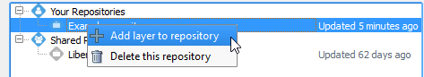

You will see the following dialog.

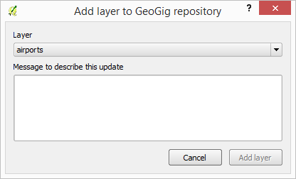

The dropdown list shows all the layers that you have loaded in your current QGIS project and can be added to the repository. Select the layer that you want to add to the repository and add a message to describe the change (for instance *Added roads layer*). Click on OK.

If your layer does not contain a field named *geogigid*, the plugin will ask you before adding it automatically to it. 

.. image:: geogigid.png
	:align: center

Such a field is needed for later tracking the features in the layer, and you will not be able to add a layer to a repository if it does not contain a *geogigid* field.

Once a new version is created in the repository with the layer that you have added, a new entry will be added to the versions list under the current branch.

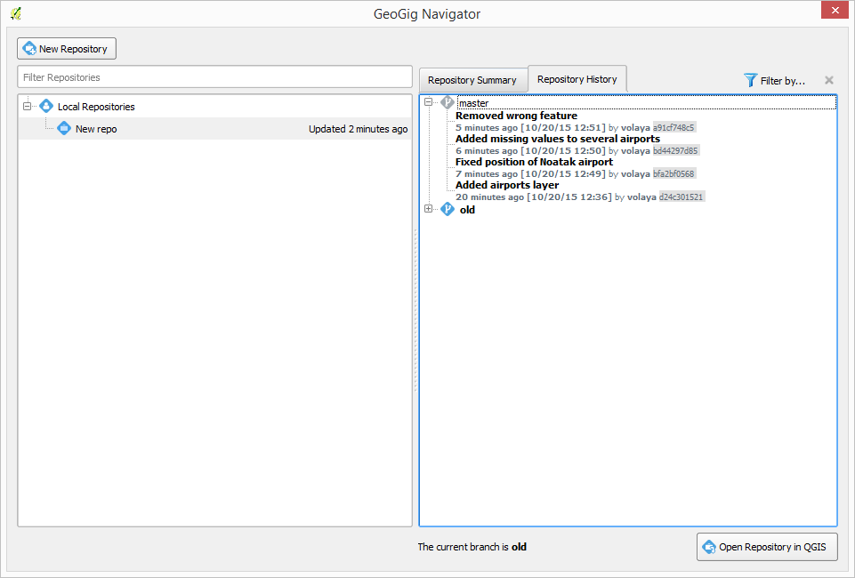

Once a layer is imported into a GeoGig repository, it becomes linked to it and will reflect the changes in the repository. That means that the content of the original layer file will be modified if the repository changes (for instance, if switching to a different branch). Also, if the layer itself is edited in QGIS, those changes will be added to the repository automatically. The layer file will from now on be in sync with the repository to which it was added.


Layers can be also added from the QGIS interface. Select the layer that you want to import in the QGIS legend and right-click on it. In the context menu, there will be a *GeoGig* section with a menu entry named *Add layer to repository...*. 

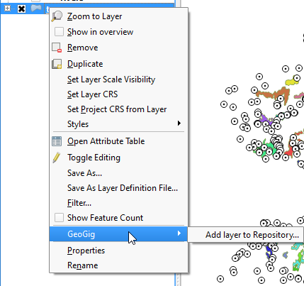

Select it and the add layer dialog will be shown.

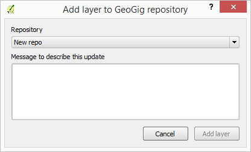

In this case, the selector is not used to select the layer to import, but the repository to import to. 

Supported formats
~~~~~~~~~~~~~~~~~~

Only layers in shapefile format are supported at the moment for adding to a GeoGig repository. If you have a layer in another format that you want to add to a GeoGig repository, you first have to convert it to a shapefile, To do so, right-click on the layer name in the QGIS legend and select *Save as*. The following dialog will be shown.

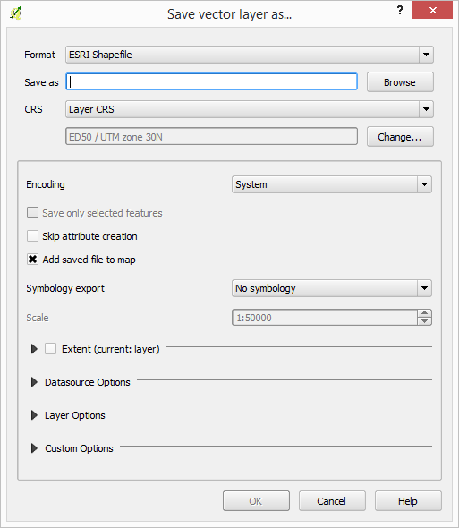

Select ESRI shapefile as output format and enter the destination path. Make sure that the *Add saved file to map* option is checked. Click on OK an the layer will be saved to a shapefile and the resulting file loaded into your current project. Now you can import that layer file to a GeoGig repo.

The original file (the one in a format other than a shapefile) is not linked to the GeoGig repo. Only the shapefile is, so edits on the original file will not be automatically put into the repository. To avoid confusion, it is recommended to remove the original layer from you current project and from this point work only with the shapefile.


Adding a set of files representing the history of a layer
**********************************************************

It might happen that you already have your history as a set of files, each of them representing a version of the data. To recreate that history in a GeoGig repository, you can use the the batch import interface. Right click on the name of the repository that you want to add the layers to and select *Add multiple snapshots of a layer to repository...*. It will open the following dialog:

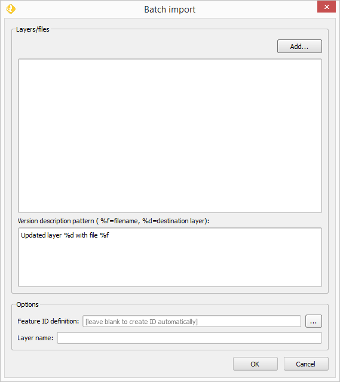

To define the batch task you just have to fill the table with the files to use to create the repository history. Click on the *Add...* button and select the files that you want to add to the list of files to use.

The order of the selected files in the list is significant, since it defines the order in which the corresponding versions will be created. The file that appear on top of the list will be the one used for the first version, and the following ones will be use to updated the repository, descending on the list.

To reorder the files in the list, just drag and drop them to a different position.

To remove one of them, click on the remove button on the right-hand side of the item in the list.

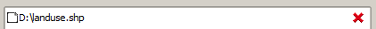


Once you have the list of files ready, you have to enter a pattern for the descriptions to use for identifying the versions that will be created. Instead of entering one description for every file, a pattern is entered, and it will be adapted for each version. The pattern is just a base string, in which you can use the following variables, which will be replaced with the corresponding values for each version.

::

   - %f: filename
   - %d: destination layer

All files are assumed to represent the same layer and you have to enter the name of that layer in the *Layer name* field. 

Features have to be identified by adding a field named named ```geogigid``` to the attributes table before importing. If your layers have an attribute that has unique values and can be used as identifier, enter its name in the feature id field, between square brackets. For instance, if your attribute is called ``unique``, enter this in the feature id field:

::

   [unique]

Attribute names are case sensitive.

You must make sure that the attributes appears in all the layers to import.

A compound identifier can be created by concatenating several fields. Just type the names of the attributes to use, always between square brackets, and they will replaced with the corresponding values when creating the ```geogigid`` field. For instance, to create an identifier using values from attributes named ``ID1`` and ``ID2`` separated by a hyphen, use this in the feature id field:

::

   [ID1]-[ID2]

Clicking on the button by the feature id box will show a menu with all the available attributes to use. The contains all the attributes that appear on all the layers already added to the list of layers to import. 

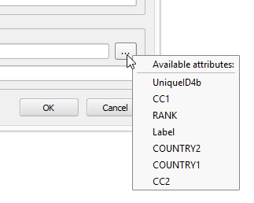

To add the attribute to you identifier definition, just select the corresponding element in the menu and the attribute name will be inserted in the text box.

If you leave the *Feature ID* field empty, the plugin will create an arbitrary id for each element. That, however, will cause id's to not be consistent across versions, so changes to a feature will not be identified as a modification, but instead as a feature deleted and another one added, since they will have different ids. This options is, thus, not recommended.

When all the information has been entered, click on *OK* to start bulding the history of the repo from the provided files. As files are imported, the corresponding line will turn green, so the file list itself acts as a progress indicator.

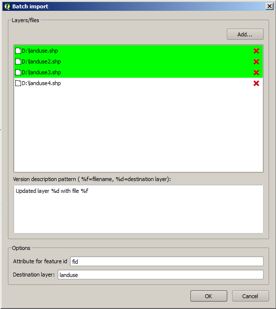

A message will be shown once the full task is finished.

.. image:: finish_batch.png
	:align: center

Editing a GeoGig layer
***********************

When a local file that was added to a GeoGig repository is edited, the GeoGig plugin will take care of managing edits done to the layer so they are transfered to the repository. That is, to edit the data in the repository, you have to edit the layer itself, which acts as the entry point to the repository in terms of editing.

To edit the layer, just edit it normally, using the QGIS edit functionality. Once you are done editing and you close the edition, the GeoGig plugin will show you a message box like the following one:

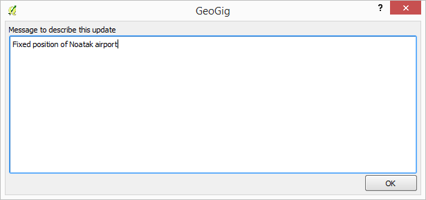

You must enter a message to describe the new version to create (a message describing the changes that are going to be applied to the layer).

Click on *OK* and the data will be incorporated to the repository, and a new version will be created.

If you want to confirm that the change has been applied to the repository, you can open the GeoGig navigator, select the repository and display the history of the current branch. You will see that it has a new entry with the same message that you entered in the version description dialog.

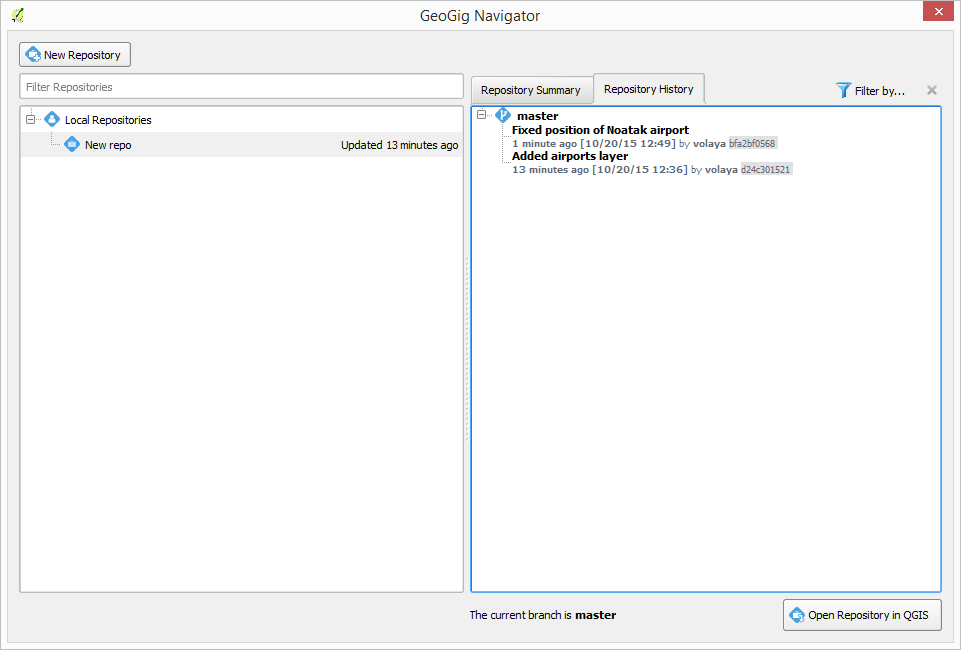

Using the repository viewer
****************************

The repository viewer allows you to perform multiple operations on a repository, and to browse its history. You can find the repository viewer in the GeoGig navigator, as it has already been shown. 

The history of the repository, with all the branches and versions that it contains, is shown. The top elements are the branches in the repository, with the current branch rendered in a bold face and with a blue icon, to help distinguish it from the remaining ones (which are rendered using normal font and a disabled icon). 

Each branch is a tree that can be expanded and contains the list of all versions in the branch. 

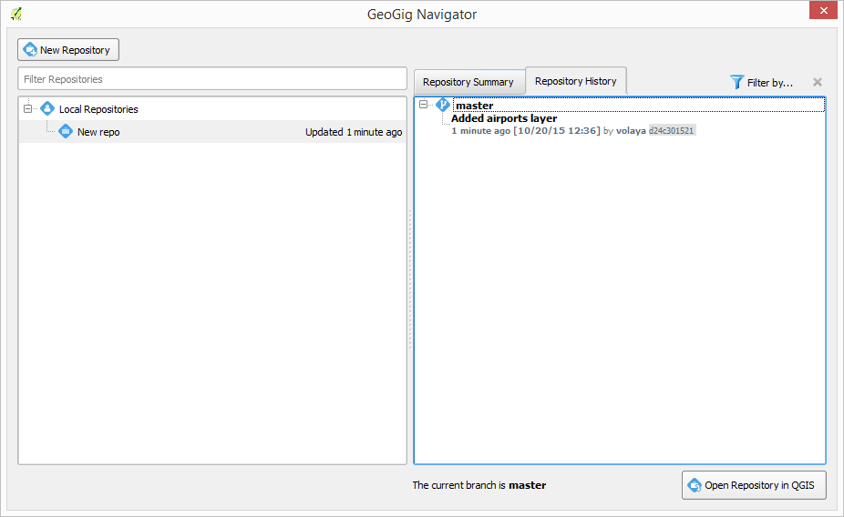


In the case of a repository that has been recently created, only the default *master* branch will exist, and it will have no versions under it, as we have already seen.

When the number of versions is large, the list of versions can be filtered, so you can easily find a given one by its description message. To filter the history of a repository in the repository viewer, select the filter icon in the upper-right corner of the history panel, and a filter panel will appear.

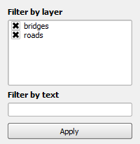

You can select/unselect the names of the layers contained in the repository, and only those versions affecting the selected layers will be shown.

If you type a text in the filter text box, only those versions that contain that text in their description message will be shown.

Changes are not applied inmediately as you type or select layers. Click on the *Apply* button to apply the selection and filter the history panel.

Another way of showing the history of a layer in a repository is to open it from the QGIS legend. If you have a layer that is versioned in a GeoGig repository, right-clicking on its name you will find a menu entry named *Browse history of this layer...* under the GeoGig submenu in the layer context menu. Select this menu entry and a new dialog with the repository viewer will be open, containing only the versions that affect the layer.

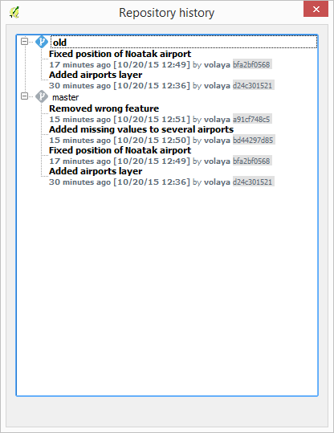

Additional operations are available by right clicking on the items in the history tree. If you click on an element representing a version, you will see the following context menu:

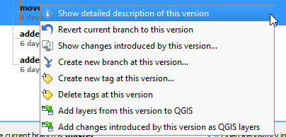

Selecting the *Show detailed description of this version* will open a new dialog with a text describing the selected version.


The remaining context menu entries will be described in further sections in this document.

Synchronizing repositories
***************************

You can access the sync dialog anytime and for any repository, by selecting the *Open Sync dialog* option in the context menu of the repository. 

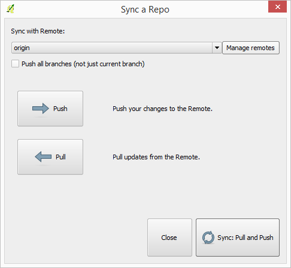

All synchronization operations can be run from there, and managing multiple remotes is also possible. This tasks are not described in this document.


Working with branches
######################

Branches are a very useful feature of GeoGig. You can create as many branches as you want, each of them with its own history, add new edits to them, and merge them later if needed. The following sections describe the available operations in the GeoGig client for working with branches.

Creating a new branch
**********************

To create a new branch, you must select the version in the current history of the repository where the branch starts. In the history panel, expand the branch where that version is located, select the corresponding version and right--click on it. You will see the following context menu.


Select the *Create new branch at this version* option and you will see the following dialog.

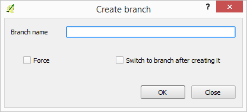

Enter the name of the branch and click on *OK*. The new branch will be created and added to the list of branches in the history panel.


Changing the current branch
***************************

You can make any branch the current branch of the repository, right--clicking on the branch name and selecting the *Make this branch the current branch* option.

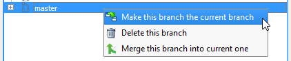

When the current branch is changed, the layers files linked to the repository will be updated, so they contain the version that is at the top of the new current branch (the latest version in the branch history). If you now make any change to any of those layers, the new versions will be added to the new current branch. The previous current branch will not be modified.

Merging branches
*****************

You can bring changes from any branch into the current branch, merging them. To merge a branch into the current one, select the branch to merge, right--click on it and select the *Merge this branch into the current branch* option.

.. image:: mergebranch.png
	:align: center

Once the merge operation is finished, the current branch will contain its own versions, along with all those that were made on the selected branch. The layers linked to the repository will be updated, since the tip of the current branch has been modified.

Deleting a branch
******************

To delete a branch, right--click on it and select the *Delete this branch* option. The branch will be deleted. The current branch cannot be deleted, so in case you want to remove it you will have to set another branch as the current one before deleting it.

Exploring differences between two versions
###########################################

There are two ways of exploring the differences between two versions in the history of a repository: using the comparison viewer of using the QGIS canvas. Both are descibed in this section

Visualizing changes using the comparison viewer
****************************************************

To visualize the changes introduced by a given version (that is, the difference between that version and previous one in the history) in the comparison viewer, right-click on it and select the *Show changes introduced by this version* menu. This will open the comparison viewer.

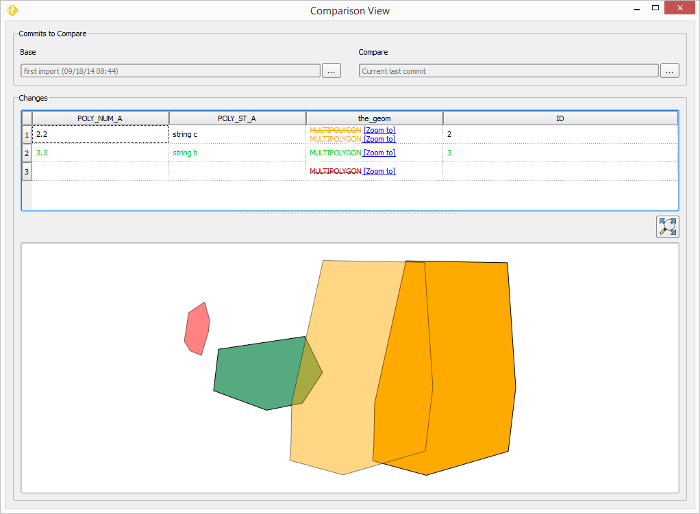

The compared versions are listed in the *Versions to Compare* section at the top of the dialog. When the dialog is opened, it compares the selected version with its parent. You can change any of the versions to be compared by clicking the button next to each text box, which will open the version selector dialog:

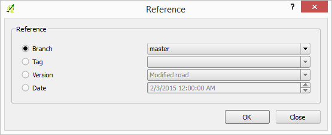

Click *OK* and the selected version will be set in the Comparison Viewer.

Changes are shown in the attribute table above and in the map canvas below. Each row in the attribute table represents a single feature that has changed. Values of attributes are colored to indicate the type of changed that has occured

* **Black**: Attribute has not changed
* **Brown**: Attribute has been modified
* **Green**: Attribute that did not exist in the original version but has been added (such as when adding a new feature or adding a new attribute)
* **Red**: Attribute that does not exist anymore (whether because it has been removed from the feature type, or because the feature itself has been removed from the repository)

In the case of a modified attribute (shown in brown), both the old and new value of the attribute are shown, the first of them being shown as striked text.

Geometries are represented in the canvas, with a color describing the type of change affecting the corresponding feature (not just the geometry attribute). 

* **Brown**: Feature has been modified
* **Green**: Feature has been added
* **Red**: Feature has been removed

Geometries corresponding to the base version (the state before the change was introduced) are represented with transparency, to help diferentiate between old and new versions.

You can modify the zoom and extent of the canvas by dragging or using the mouse wheel.

The canvas and the table are linked. Clicking on a row will automatically select the corresponding geometry in the canvas, so you can easily find it. Notice that, if the geometry has been modified and there are two geometries corresponding to the old and new versions, both of them will get selected. Clicking on the *[Zoom to]* link in the table for a given geometry will zoom the canvas to that geometry.

Clicking on a geometry in the canvas will select the corresponding row in the table. It will also select the other version of the geometry for that feature, in case the geometry has been modified.

Two explore the changes between to versions that are not consecutive, you can change the *base* and *compare* versions in the upper part of the comparison viewer, as it has been explained. Another way of doing it is to select both versions in the repository viewer (click on the first one and then on the second one while keeping the Ctrl key pressed), then right-click and select the *Show changes between this versions* menu. The comparison viewer will be open, with the two selected version used as *Base* (the older one of them) and *Compare* (the most recent one of them).

Visualizing changes in the QGIS canvas
**************************************

Another option for visualizing changes is to add layers to the current project that contain the features that have been modified by a version. Select the version in the repository viewer, right-click on it and seelct *Add changes introduced by this version as QGIS layers*.

Two layers will be added, one with the features as they were before the selected version, and another one with the features after the version was created. Features not affected by the selected versions are not added to any of these layers.

The names of the feature include the ids of the version being compared and the suffix *after* or *before* to indicate the state of the repository that the layer represents

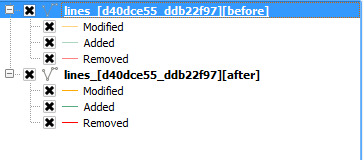

The attributes table of both layers contains an additional attribute (apart from the ones in the layer itself) named *changeType*, which indicates the type of change that occured for each feature.

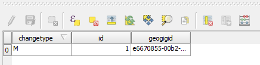

*M* indicates a modified feature, *A* and added one, and *R* indicates a feature that was removed.

The symbology of the layer is based on this additional field. 

To add layers that show the differences between two arbitrary versions, select them in the history viewer as it was explained for the case of using the comparison viewer. Then right-click and select *Add changes between these versions as QGIS layers*.

Changes introduced by a single version oncly affect a single layer. In the case of comparing to versions, the differences between them might include several repository layers, so more layers will be added to the QGIS project. For each repository layer modified between the selected versions, two layers will be added to the QGIS project. Layer are named using the layer name, the ids of the two versions involved, and the tag *before* or *after*, to indicate to which of the compare versions corresponds the layer itself.


Other advanced topics
#####################

The following sections describe some additional functionality and discuss more advanced topics.

Opening a given version in the current QGIS project
****************************************************

Any version from a repository can be added to QGIS. A layer will be added for each repository layer in the selected version, and its name will include the id of the version.

Unlike the layers that represent the current state of the repository, which are linked to it and are kept in sync with the repository by the GeoGig plugin, these layers exported from a given version are not linked to it. Moreover, editing is disabled for them, so you cannot edit such a layer.

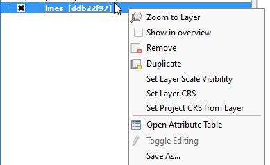

You can use this layers form comparing with the current state of the repository or just to perform analysis based on the repository data as it was at a certain point of its history, but not for editing and adding new versions based on them. 

If you want to edit layers starting with a given version, create a new branch at that version, switch to that branch and then edit the corresponding layers that represent the current state of the repository.

Removing a layer from a repository
***********************************

If you no longer want to have a layer in your repository, you can remove it by right-clicking on it in the QGIS legend and selecting *Remove this layer from repository* in the versio submenu.

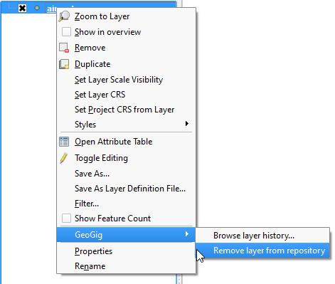

A new version will be added to the repository, which removes the selected layer.

The layer will not be unloaded from QGIS and will still be part of you QGIS project, but it will not be tracked anymore. Any change made to that layer in QGIS will have no effect in the repository, since the layer file and the repository are now independent and not linked.

Tags
*****

You can add tags to any version in the repository history. To add a tag, select the version that you want to tag in the repository viewer, right-click on it and select *Create new tag at this version...*. 

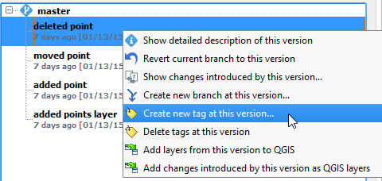


You will be prompted to enter the name of the tag to create.


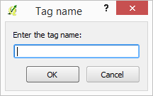

When a version has a tag, it will be shown in the history tree

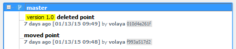

To remove a tag from a version, right-click on the version item and select *Delete tags from this version*.

Conflicts
**********

When merging a branch or retrieving changes from a remote repository, it might happen that a feature has been modified in a different way in each of the branches/repositories involved. This causes a conflicting situation that has to be manually solved. For each feature in a conflicted situation (a feature that has been modified differently in the local branch and in the one to merge or the remote repository), you will have to decide which version of it you want to keep.

When a sync or merge operation results in conflicts, the GeoGig client will signal it in the status label below the repositories panel, as shown next.

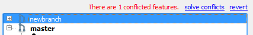

Click on *Solve* to open the conflict solving interface, which looks like this.

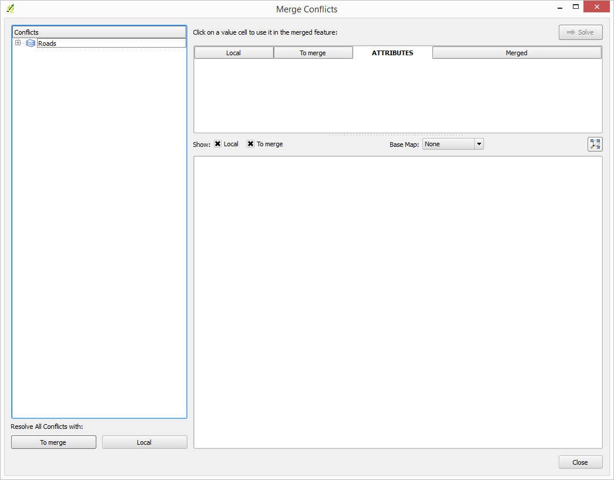

On the left side you will find a list of all conflicted features, grouped by layer. Clicking a feature item will display the conflicting values in the table and canvas on the right side:

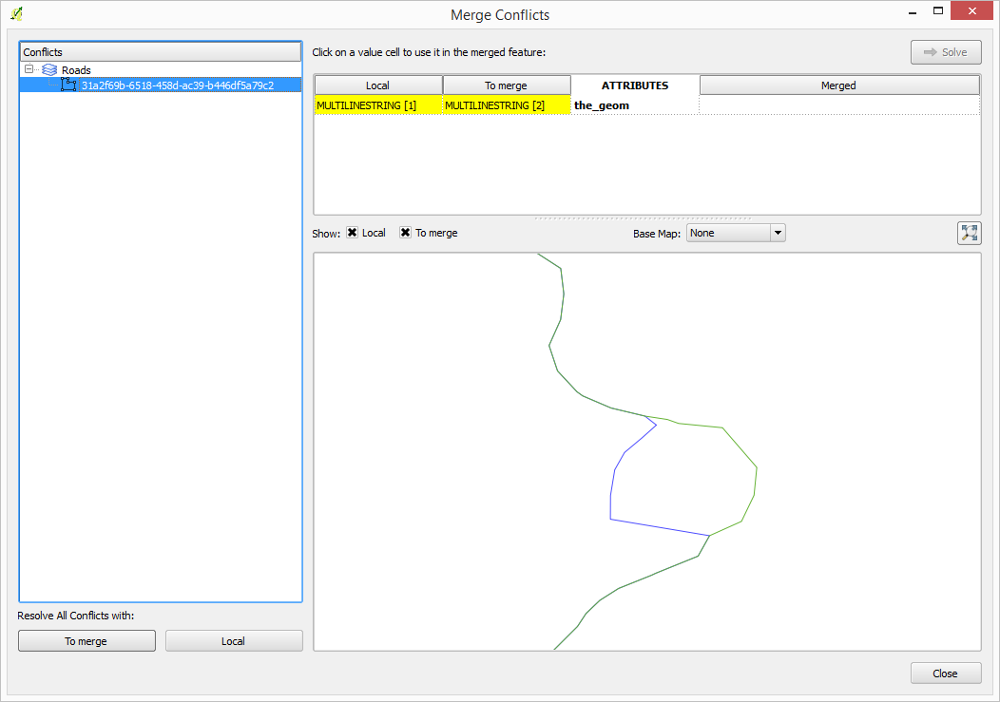

The table shows all attributes and the corresponding values for the two versions in conflict:

* **To merge**: The feature as it was modified in the remote repository or the branch to be merged
* **Local**: The feature as it was modified in the local repository or current branch that will receive the new changes

Conflicting values will be shown in *yellow*, and the corresponding *Merged* cell in the table will be empty. If an attribute has no conflict, it will be displayed in *white*, and will also be shown in the *Merged column. 

Solving a conflict is done by selecting the value to use from any of the two columns (*To merge* or *Local*). Click the version to use, and its value will be put in the *Merged* column. The row will not be shown as conflicted anymore.

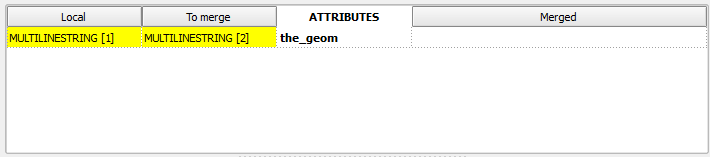
   
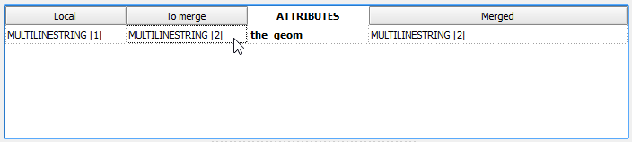
   
Once the conflict for a given attribute has been solved, you can still click a cell to use its value in the merged feature. You can even click attributes that were never conflicted, in case it is different from the other values.

The geometry of the feature, whether conflicted or not, will be represented in the window canvas. You can toggle the rendering of the different versions using the checkboxes. 

.. image:: conflictcanvas.png
	:align: center

No interaction is currently available in the canvas other than zooming and panning. To solve a conflict in a geometry, you must use the table.

Once you have solved all conflicts (that is, there are no yellow cells in your attribute table), the *Solve* button will be enabled. When you click it, the conflict for the current feature will be solved, and its entry will be inserted in the repository.

Repeat the above steps for each conflicted feature before closing the dialog. After closing the conflicts window, and only if all conflicts were solved, the new version corresponding to the merge or sync operation will be created and added to the history panel. The description of this new version will contain a list of all the features that were conflicted and required to be fixed.

Reverting to a previous version
*********************************

You can discard all changes introduced from a given version and revert the repository to the state it was in at that version. Select the version in the history panel, right-click on it and select *Revert to this version*. A new version will be added, which contains all the changes from that selected version to the current one, but reversed.


